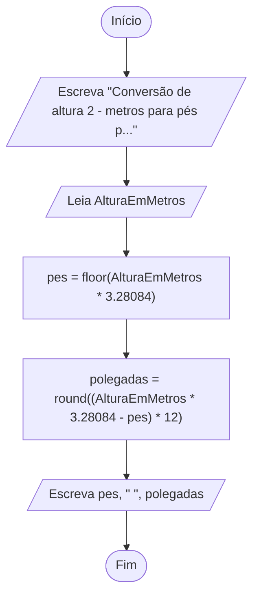
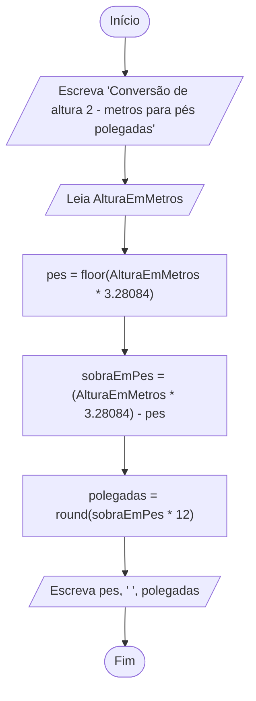

# Exercício em sala: Conversão de altura

Nos Estados Unidos da América, a altura de uma pessoa é medida em pés + polegadas. Por exemplo, considere uma pessoa com 5 pés + 11 polegadas de altura (escrito simplesmente como 5′11′′); sabendo que 1 pé equivale a 12 polegadas, e 1 polegada equivale a 2.54 centímetros, conclui-se que tal pessoa mede 180.34 cm, ou seja, aproximadamente 1.80 m.

a. Elabore um fluxograma e um pseudocódigo para um algoritmo que Lê dois números inteiros representando os valores da altura de uma pessoa em pés + polegadas e ESCREVE o valor da altura em metros. Em seguida, execute um teste de mesa com a entrada 5 11; a saída deve ser 1.8034.

b. Elabore outro fluxograma e um pseudocódigo, agora para um algoritmo que LÊ um único valor em metros e ESCREVE os valores em pés e polegadas correspondentes. Assuma que exista uma função chamada round que arredonda um número real para o inteiro mais próximo; por exemplo, round(3.14) = 3, round(3.86) = 4 e round(5) = 5. Em seguida, execute um teste de mesa com a entrada 1.8; a saída deve ser 5 11.

## Resolução

### Fluxograma

- [a - Link para a fluxograma no fluxolab.app](https://fluxolab.app/?lzs=NoIhBplAHBTBnCAGAupE0D2AbWBzAQwBMDFxV0BBbAFwFcAnAgUQFsBhAWWRTSiXABmIQCYBARiQCw6AEaYaNTKxC9II8AFZRAkQDZpAHRABJAHYAzTA1awABNACX8O-ay5CJF-FjQCTIkwHazs6Vld4PwBzzGMIUHlFZVU+YQAWHSE06Th4cGCPYlJ4kESlFTVgDIAOTINpeMrtPUy07PAQanomNi4AXgAKIdyAKnERAEoRkQA6TTSJgGp3fCL4abmFgHpJJBKy5MqW7UExLTPO2kYWDm45BXKUvmANSSFU8DfNPm03vT4Wm80nwJLpeCggA)

- a - Fluxograma em Mermaid

- [b  - Link para a fluxograma no fluxolab.app](https://fluxolab.app/?lzs=NoIhBplBBAbAXArgJwIYFEC2BZApvZAewGcIAGAXUhAAddTxLqbDZcBzVAE1QadGKEARmiwAFeuQpUoZcAGZwAJgBscgIwAWOWGpDC8eIUwhpkdeACsytcqU6AOiADChAHYA3XMmIBjwgAEXLgBqAgoqAFKAQC0AZj4RMQBNKhoKQCXySxsnDzEThCg+obGpjJK4Jo2ckoAHDpwSKI4iSRFICVGJmbAiio1CtrgtPQAvABmsISEyAAUTRFYeAQkAFTyAHT1ZHWaAJQdXWW91QOqcpq2tKwc3LxjRIhuXHOCIhiYEsRr6kqHegM3XKkGs1guVnsIzoxHATgCTnAKVueV4RyBJxkAzqg0sDRGRV6AHZwOdbNodO8Wt8xgtwi0VkkNtsGnt9jEYejSj1esANBoZBZ1LUKuBhQoZNVxZYZNZxSoZIpxUSZCTxZppBQgA)

- b - Fluxograma em Mermaid

### Pseudocódigo

